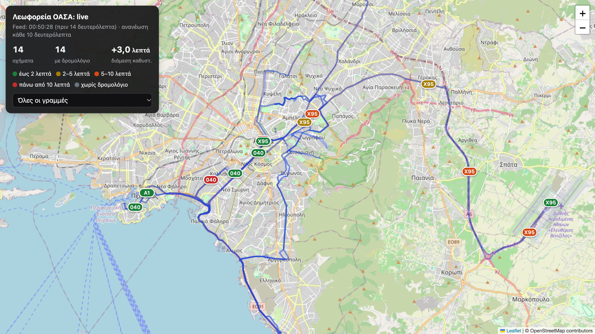

# athens-gtfs-realtime (Proof of Concept)

Ανεξάρτητη υλοποίηση **GTFS-Realtime** για τα λεωφορεία και τα τρόλεϊ της Αθήνας (ΟΑΣΑ). Συνδυάζει:

- Το **επίσημο στατικό GTFS** του ΟΑΣΑ (`osy_gtfs.zip` από το data.gov.gr).
- Τα ζωντανά δεδομένα της **τηλεματικής** (`telematics.oasa.gr/api`, βλ. [τεκμηρίωση](https://oasa-telematics-api.readthedocs.io/en/latest/)).

Παράγει δύο feeds: `vehicle_positions.pb` και `trip_updates.pb` (καθώς και αντίστοιχα αρχεία `.json` για έλεγχο).

## Σε μία ματιά

Αξιολόγηση σε πραγματικές συνθήκες (πρωινή αιχμή Δευτέρας 05/10/2026, 18 γραμμές, 180 οχήματα) έναντι των πραγματικών διελεύσεων από στάσεις βάσει GPS:

- **Χρόνοι άφιξης:** Διάμεσο σφάλμα **0,5′** (έως 5 λεπτά πριν την άφιξη) και **1,1′** (5–10 λεπτά πριν). Το στατικό πρόγραμμα (ό,τι εμφανίζει σήμερα το Google Maps) έχει σφάλμα 6,2′ και 6,5′ αντίστοιχα. Για ορίζοντα έως 10 λεπτών, η ακρίβεια ταυτίζεται με εκείνη της τηλεματικής του ΟΑΣΑ.
- **Αντιστοίχιση σε δρομολόγιο:** Έως **98%** των ενεργών οχημάτων.
- **Εγκυρότητα:** **0 σφάλματα και 0 προειδοποιήσεις** στον επίσημο [GTFS-RT validator](https://github.com/MobilityData/gtfs-realtime-validator) της MobilityData.
- Οι μέθοδοι που αξιολογήθηκαν καλύτερα (αντιστοίχιση «με μνήμη», πρόσφατοι χρόνοι ανά τμήμα) χρησιμοποιούνται πλέον στο live feed.
- **Περιορισμοί στατικού GTFS:** Το διαθέσιμο GTFS δεν αποτυπώνει την πραγματική λειτουργία (ελλείψεις δρομολογίων, εφαρμογή θερινού ωραρίου, λήξη στις 06/10/2026), επηρεάζοντας αρνητικά κάθε εφαρμογή που βασίζεται σε αυτό, συμπεριλαμβανομένου του Google Maps.

Αναλυτικά στοιχεία στην ενότητα [Αξιολόγηση](#αξιολόγηση-με-πραγματικές-αφίξεις).

## Χρήση

```bash
python3 -m venv .venv && .venv/bin/pip install -r requirements.txt
.venv/bin/python -m oasa_rt --lines 040,550,Α1 --once                       # Εκτέλεση ενός κύκλου -> out/
.venv/bin/python -m oasa_rt --lines 040,550 --interval 30 --serve 8080     # + ζωντανός χάρτης στο http://localhost:8080/
.venv/bin/python -m oasa_rt --lines 040 --matcher greedy --eta schedule     # Προηγούμενες, απλούστερες μέθοδοι
.venv/bin/python -m oasa_rt.compare --lines 040,550                         # Γρήγορη σύγκριση με τις εκτιμήσεις του ΟΑΣΑ
.venv/bin/python -m oasa_rt.record --lines 040,550 --end 2026-10-05T10:00   # Καταγραφή σε SQLite για αξιολόγηση
.venv/bin/python -m oasa_rt.replay data/record.sqlite                       # Αξιολόγηση καταγεγραμμένων δεδομένων
.venv/bin/python -m oasa_rt.replay data/record.sqlite --identity-only       #   Μόνο αντιστοίχιση οχήματος σε δρομολόγιο
.venv/bin/python -m oasa_rt.replay data/record.sqlite --blocks              #   Έλεγχος τήρησης «προγραμμάτων οχήματος»
```

Απαιτείται Python ≥ 3.9. Αν το `data/osy_gtfs.zip` δεν υπάρχει τοπικά, λαμβάνεται αυτόματα.

## Χάρτης

Με την παράμετρο `--serve 8080`, η εφαρμογή σερβίρει τα feeds μαζί με έναν ζωντανό χάρτη στο http://localhost:8080/.



- **Οχήματα:** Εμφάνιση με τον αριθμό της γραμμής και χρωματική διαβάθμιση καθυστέρησης (έως 2′, 2–5′, 5–10′, >10′, ή χωρίς αντιστοίχιση).
- **Διαδρομές:** Σχεδίαση βάσει του `shapes.txt` στο χρώμα της γραμμής, με δυνατότητα φιλτραρίσματος.
- **Επιλογή οχήματος (κλικ):** Καθυστέρηση, δρομολόγιο (π.χ. «00:35 ΠΕΙΡΑΙΑΣ → ΣΥΝΤΑΓΜΑ»), επόμενη στάση, χρόνος τελευταίας θέσης GPS και επισήμανση της διαδρομής με τις στάσεις της.
- **Επιλογή διαδρομής:** Κατεύθυνση, πλήθος και γεωγραφική θέση των στάσεων.
- **Ζωντανή ενημέρωση:** Ειδοποίηση μέσω Server-Sent Events (`/events`) με κάθε νέο feed. Τα οχήματα κινούνται ομαλά στη νέα τους θέση και οι χρόνοι ανανεώνονται δυναμικά (με αυτόματο έλεγχο ανά 10″ σε περίπτωση αποσύνδεσης).
- **Υπόβαθρο:** Βασίζεται σε Leaflet και OpenStreetMap (απαιτείται πρόσβαση στο διαδίκτυο).

Τα αρχεία `static.json` και `trips.json` στον φάκελο εξόδου εξυπηρετούν αποκλειστικά τον χάρτη (ονόματα, χρώματα, διαδρομές) και δεν αποτελούν μέρος του GTFS-Realtime.

## Τρόπος λειτουργίας

1. **Αντιστοίχιση κωδικών:** Στο GTFS ισχύει `stop_id` = `StopCode` της τηλεματικής. Οι κωδικοί γραμμών και διαδρομών (`LineCode`/`RouteCode`) συνήθως ταυτίζονται με τα `route_id`/`shape_id` (460 από τα 473 `LineCode` υπάρχουν ως `route_id`), υπάρχουν όμως εξαιρέσεις (π.χ. η γραμμή 040 στην τηλεματική χρησιμοποιεί τους κωδικούς 3922/3923/3924 ενώ στο GTFS τους 5512/5513/5535, και τα νυχτερινά του Χ96 εμφανίζονται με LineCode 1153 αντί για 892). Για τον λόγο αυτό, τα δρομολόγια αναζητούνται σε όλες τις παραλλαγές της γραμμής και η διαδρομή ταυτοποιείται βάσει της ακολουθίας των στάσεων.
2. **Θέσεις οχημάτων:** Ανάκτηση μέσω `getBusLocation` ανά `RouteCode` (κωδικός οχήματος, γεωγραφικές συντεταγμένες, κατεύθυνση, χρονοσφραγίδα). Μία κλήση επιστρέφει όλα τα οχήματα της εκάστοτε διαδρομής.
3. **Πρόοδος στη διαδρομή:** Η θέση του οχήματος προβάλλεται στη γεωμετρία της διαδρομής (`shapes.txt`). Οι στάσεις αντιστοιχίζονται διαδοχικά πάνω στη διαδρομή ώστε να υποστηρίζονται σωστά οι κυκλικές γραμμές. Όταν ένα όχημα διέρχεται από το ίδιο σημείο περισσότερες από μία φορές, η σωστή διέλευση επιλέγεται βάσει της κατεύθυνσης κίνησης και του προγράμματος. Αν δεν υπάρχει γεωμετρία (shape), χρησιμοποιείται ευθεία γραμμή μεταξύ των στάσεων.
4. **Αντιστοίχιση οχήματος σε δρομολόγιο (Vehicle → Trip):** Η τηλεματική δεν παρέχει αναγνωριστικό δρομολογίου (`trip_id`). Για κάθε υποψήφιο δρομολόγιο υπολογίζεται η απόκλιση μεταξύ τρέχουσας και προγραμματισμένης θέσης, και η ανάθεση γίνεται ένα-προς-ένα. Οχήματα χωρίς εύλογο δρομολόγιο (απόκλιση εκτός του διαστήματος −10′ έως +60′) εξάγονται μόνο με θέση και `route_id`. Από προεπιλογή χρησιμοποιείται η μέθοδος **«με μνήμη»** (`--matcher memory`): ανάθεση Hungarian ανά γραμμή, κόστος βάσει των θέσεων των τελευταίων 15 λεπτών και «κλείδωμα» του δρομολογίου όταν παρατηρηθεί η αναχώρηση από την αφετηρία. Στο [matcher.py](oasa_rt/matcher.py) διατίθενται επίσης οι μέθοδοι `greedy`, `hungarian` και `hmm`.
5. **Διελεύσεις από στάσεις:** Από τα διαδοχικά στίγματα GPS κάθε οχήματος εντοπίζεται σε πραγματικό χρόνο η στιγμή διέλευσης από κάθε στάση (`PassageTracker` στο [eta.py](oasa_rt/eta.py)) και, κατ' επέκταση, ο χρόνος κάθε τμήματος μεταξύ διαδοχικών στάσεων. Ο ίδιος κώδικας χρησιμοποιείται και στην αξιολόγηση.
6. **Ενημερώσεις δρομολογίων (TripUpdates):** Για κάθε επόμενη στάση δημοσιεύεται η προβλεπόμενη ώρα άφιξης (`arrival.time`) και η αντίστοιχη καθυστέρηση (`arrival.delay`). Από προεπιλογή (`--eta recent`) κάθε τμήμα υπολογίζεται με τον διάμεσο χρόνο των τελευταίων 45 λεπτών· τμήματα με λιγότερες από 2 πρόσφατες διελεύσεις (π.χ. αμέσως μετά την εκκίνηση) χρησιμοποιούν τον χρόνο του προγράμματος. Με `--eta schedule` εφαρμόζεται παντού «πρόγραμμα + τρέχουσα καθυστέρηση».
7. **Ενημέρωση στατικού GTFS:** Κάθε 6 ώρες ελέγχεται αν το data.gov.gr διαθέτει νεότερη έκδοση (`ETag`/`Last-Modified`). Εφόσον υπάρχει, λαμβάνεται, ελέγχεται και φορτώνεται χωρίς επανεκκίνηση. Αν απομένουν έως 7 ημέρες μέχρι τη λήξη, εκδίδεται προειδοποίηση.

**Έλεγχος εγκυρότητας (Validator):** Ο επίσημος [GTFS-RT validator](https://github.com/MobilityData/gtfs-realtime-validator) της MobilityData (batch mode, 4 διαδοχικά στιγμιότυπα του live feed, 05/10/2026, γραμμές 040, 550, 608, Χ95) δεν εντοπίζει **κανένα σφάλμα και καμία προειδοποίηση**. Όταν υπάρχουν οχήματα χωρίς αντιστοίχιση σε δρομολόγιο, εμφανίζονται οι προειδοποιήσεις W006/W009, καθώς αυτά εξάγονται σκόπιμα μόνο με `route_id`.

## Αξιολόγηση με πραγματικές αφίξεις

Καταγραφή μέσω `oasa_rt.record` (Δευτέρα 05/10/2026, 07:00–10:00): 18 γραμμές, 180 οχήματα, 46.830 στίγματα GPS, με ρυθμό ~1 αίτημα/δευτερόλεπτο προς την τηλεματική χωρίς κανένα σφάλμα επί 3 ώρες. Από τα δεδομένα GPS υπολογίστηκαν **13.412 πραγματικές διελεύσεις από στάσεις** και **289 αναχωρήσεις από αφετηρίες**, ανεξάρτητα από οποιαδήποτε μέθοδο αντιστοίχισης. Η αξιολόγηση αναπαράγεται με `python -m oasa_rt.replay <βάση>`.

### Χρόνοι άφιξης

Διάμεσο σφάλμα σε λεπτά ως προς την πραγματική διέλευση (σε παρένθεση: 90ό εκατοστημόριο / p90, δηλαδή το μέγιστο σφάλμα στο 90% των περιπτώσεων):

| Ορίζοντας πρόβλεψης | Στατικό πρόγραμμα | Πρόγραμμα + τρέχουσα καθυστέρηση | Πρόσφατοι χρόνοι ανά τμήμα | Τηλεματική ΟΑΣΑ |
|---|---|---|---|---|
| 0–5 λεπτά | 6,2 (25,6) | 0,6 (2,3) | **0,5** (1,7) | 0,6 (1,7) |
| 5–10 λεπτά | 6,5 (26,5) | 1,8 (5,0) | **1,1** (3,7) | 1,2 (2,9) |
| 10–20 λεπτά | 7,3 (27,6) | 3,1 (8,6) | 2,0 (6,1) | **1,8** (4,7) |
| 20–30 λεπτά | 8,3 (28,6) | 4,7 (12,2) | 3,3 (9,1) | **2,7** (6,8) |

Οι τρεις πρώτες στήλες αφορούν τα δρομολόγια που αντιστοιχίζει η μέθοδος «με μνήμη», με τις προβλέψεις να υπολογίζονται από τη στιγμή του στίγματος GPS, όπως ακριβώς στο live feed. Σε πανομοιότυπα δείγματα (ίδιο όχημα, στάση και χρονική στιγμή) οι πρόσφατοι χρόνοι δίνουν 0,5′ / 1,0′ / 1,9′ / 3,3′ έναντι 0,6′ / 1,2′ / 1,8′ / 2,7′ της τηλεματικής του ΟΑΣΑ.

- **Στατικό πρόγραμμα:** Η εκτίμηση βάσει ωραρίου (ό,τι εμφανίζει σήμερα το Google Maps). Εξαρτάται από το ποιο δρομολόγιο θεωρείται ότι εκτελεί κάθε όχημα.
- **Πρόγραμμα + τρέχουσα καθυστέρηση** (`--eta schedule`): Η αρχική μέθοδος του live feed. Θεωρεί την καθυστέρηση σταθερή μέχρι το τέλος της διαδρομής (σε συνθήκες αιχμής υποεκτιμά τον χρόνο κατά ~2 λεπτά σε ορίζοντα 20–30 λεπτών).
- **Πρόσφατοι χρόνοι ανά τμήμα** ([eta.py](oasa_rt/eta.py)): Χρήση του διάμεσου χρόνου διέλευσης των τελευταίων 45 λεπτών για κάθε τμήμα μεταξύ διαδοχικών στάσεων, αξιοποιώντας αποκλειστικά δεδομένα διαθέσιμα σε πραγματικό χρόνο. Κοινά τμήματα διαφορετικών γραμμών συνεξετάζονται. Αποτελεί την προεπιλογή του live feed (`--eta recent`).
- **Τηλεματική ΟΑΣΑ:** Προβλέψεις μέσω `getStopArrivals` (στρογγυλοποιημένες σε ακέραια λεπτά).

### Αντιστοίχιση οχήματος σε δρομολόγιο

| Μέθοδος ([matcher.py](oasa_rt/matcher.py)) | Ποσοστό αντιστοίχισης | Συμφωνία με αναχώρηση αφετηρίας | Αλλαγές δρομολογίου εν κινήσει | Αντιστροφές σε προσπεράσεις (28) |
|---|---|---|---|---|
| Greedy (αρχική μέθοδος) | 94,2% | 49,8% | 1.333 | 1 |
| Hungarian | 98,0% | 58,7% | 1.272 | 1 |
| Με μνήμη (αναχώρηση + 15′ ιστορικό, live feed) | **98,0%** | **76,4%** | 1.044 | 0 |
| HMM (Viterbi + Hungarian) | 95,8% | 60,1% | **906** | 0 |

- Ο αλγόριθμος Hungarian αντιστοιχίζει ~4% περισσότερα οχήματα σε σχέση με τη greedy μέθοδο, καθώς βελτιστοποιεί συνολικά την ανάθεση και αποτρέπει μονοπωλήσεις δρομολογίων.
- Σε γραμμές υψηλής συχνότητας, η στιγμιαία θέση δεν αρκεί για τη διάκριση διαδοχικών δρομολογίων· η εκτιμώμενη αναχώρηση και το ιστορικό του οχήματος βελτιώνουν θεαματικά την ακρίβεια (από 49,8% σε 76,4%).
- Οι προσπεράσεις μεταξύ λεωφορείων της ίδιας γραμμής είναι σπάνιες (28 σε 3 ώρες) και αντιμετωπίζονται ομαλά από όλες τις μεθόδους.
- Η ταυτότητα του δρομολογίου (`trip_id`) έχει αμελητέα επίδραση στην ακρίβεια της ώρας άφιξης, αλλά είναι καθοριστική για τη σωστή απεικόνιση του δρομολογίου στις εφαρμογές (π.χ. Google Maps).

**Επιφυλάξεις:** Τα δεδομένα προέρχονται από ένα μεμονωμένο πρωινό. Οι παράμετροι των μεθόδων με μνήμη και HMM ρυθμίστηκαν στο ίδιο σύνολο δεδομένων και απαιτείται επικύρωση σε νέες καταγραφές. Επιπλέον, η συμφωνία με την παρατηρούμενη αναχώρηση αποτελεί ισχυρή ένδειξη αλλά όχι απόλυτο ground truth.

## Παρατηρήσεις για το στατικό GTFS του ΟΑΣΑ

- **Γραμμή Χ96:** Τα νυχτερινά δρομολόγια (LineCode 1153, ~20:00–04:30) απουσιάζουν από το GTFS, παρότι στην τηλεματική κινούνταν 6 λεωφορεία.
- **Τρόλεϊ 1:** Το GTFS περιλαμβάνει μόνο μια συντομευμένη παραλλαγή (1760, «ΕΩΣ ΛΕΩΦ. ΕΛ. ΒΕΝΙΖΕΛΟΥ»), ενώ στην πραγματικότητα εκτελείται η πλήρης διαδρομή (1069).
- **Επικαιρότητα:** Το στατικό feed καλύπτει την περίοδο 06/07–06/10/2026 και έως τις 05/10/2026 δεν είχε δημοσιευθεί νεότερο. Η τηλεματική εφαρμόζει ήδη χειμερινά δρομολόγια («WINTER DAILY»).
- **Απόκλιση από την πραγματικότητα:** Οι αναχωρήσεις από τις αφετηρίες γίνονται με διάμεση καθυστέρηση 2,5 λεπτών, ενώ 16 από τις 289 αναχωρήσεις δεν αντιστοιχούσαν σε κανένα προγραμματισμένο δρομολόγιο. Μόλις **1 στα 4** διαδοχικά δρομολόγια του ίδιου οχήματος ακολουθεί την προγραμματισμένη αλληλουχία («πρόγραμμα οχήματος» / block id εντός του `trip_id`), πιθανόν λόγω διαφορών μεταξύ θερινού και χειμερινού προγραμματισμού.

## Περιορισμοί

- **Google Maps:** Δεν δέχεται realtime feeds από τρίτους· απαιτείται καταχώριση από τον επίσημο πάροχο (ΟΑΣΑ). Για την Google αρκούν τα `VehiclePositions` με αντιστοιχισμένο `trip_id`, καθώς υπολογίζει εσωτερικά τους χρόνους άφιξης. Ένα ανεξάρτητο feed μπορεί ωστόσο να αξιοποιηθεί άμεσα από ανοιχτές πλατφόρμες (Transitous, OpenTripPlanner, MOTIS) ή να καταχωρηθεί στο Mobility Database ως community feed.
- **Εξωτερικοί χρόνοι διαδρομής (Google Routes API):** Δεν χρησιμοποιούνται. Αφορούν κίνηση Ι.Χ. (χωρίς στάσεις και λεωφορειολωρίδες), οι όροι χρήσης απαγορεύουν την αναδημοσίευση σε ανοιχτό feed και υπάρχει κόστος ανά κλήση. Η παρατήρηση των ίδιων των λεωφορείων αποτελεί ακριβέστερη και δωρεάν πηγή.
- **Επιβάρυνση διακομιστή ΟΑΣΑ:** Απαιτείται μία κλήση ανά διαδρομή ανά κύκλο. Για το σύνολο του δικτύου (709 διαδρομές), κύκλος 30″ αντιστοιχεί σε ~24 αιτήματα/δευτερόλεπτο προς διακομιστή παλαιότερης τεχνολογίας (PHP 5.4). Η καθολική εκτέλεση σε τέτοια κλίμακα δεν συνιστάται χωρίς συνεννόηση με τον οργανισμό. Στρατηγικές όπως η αραιότερη ανάκτηση ανενεργών γραμμών (`oasa_rt.record`) περιορίζουν σημαντικά τον φόρτο.
- **Εξάρτηση από το στατικό GTFS:** Η αξιοπιστία της αντιστοίχισης και των `TripUpdates` εξαρτάται άμεσα από την ποιότητα του στατικού GTFS. Χωρίς ανανεωμένο feed μετά τις 06/10/2026 δεν είναι δυνατή η αντιστοίχιση δρομολογίων.

## Επόμενα βήματα

1. **Συλλογή πρόσθετων δεδομένων:** Νέες καταγραφές (διαφορετικές ημέρες, απογευματινή αιχμή) για επικύρωση των ευρημάτων και μοντελοποίηση τυπικών χρόνων ανά ώρα της ημέρας.
2. **Επικαιροποίηση στατικού GTFS:** Επανέλεγχος των αλληλουχιών δρομολογίων (`replay --blocks`) και της μεθόδου HMM μόλις δημοσιευθεί το νέο χειμερινό GTFS.
3. **Αυτοματοποιημένες δοκιμές (tests):** Κάλυψη της λογικής αντιστοίχισης και παραγωγής feeds.
4. **Δημόσια διάθεση feed:** Φιλοξενία σε διακομιστή με σταθερό URL (HTTPS) για επιλεγμένες βασικές γραμμές.
5. **Καταχώριση στο [Mobility Database](https://mobilitydatabase.org):** Ως community feed για ενσωμάτωση σε ανοιχτές πλατφόρμες δρομολόγησης.
6. **Επικοινωνία με τον ΟΑΣΑ:** Κατάθεση τεχνικής πρότασης για επίσημο GTFS-Realtime (ώστε να ενεργοποιηθεί και στο Google Maps), συνοδευόμενη από τα δεδομένα αξιολόγησης και τις καταγεγραμμένες ελλείψεις.

## Άδεια χρήσης

MIT, βλ. [LICENSE](LICENSE). Το έργο αναπτύσσεται ανεξάρτητα και δεν συνδέεται με τον ΟΑΣΑ. Χρησιμοποιεί το δημόσιο αλλά μη τεκμηριωμένο API της τηλεματικής, το οποίο ενδέχεται να αλλάξει χωρίς προειδοποίηση.

## English summary

Unofficial, volunteer-built **GTFS-Realtime** producer (VehiclePositions + TripUpdates) for Athens buses and
trolleys (OASA). OASA publishes an official static GTFS and runs a live telematics API, but no GTFS-Realtime feed,
so Google Maps and other journey planners only show scheduled times. The telematics API reports vehicle positions
per route without a trip id; this project matches each vehicle to a scheduled GTFS trip (route-code mapping by stop
sequence, projection onto `shapes.txt`, one-to-one assignment; greedy, Hungarian, memory-based and HMM variants
are evaluated, the memory-based one is used live) and publishes a predicted arrival time for every stop ahead,
from stop-to-stop travel times observed live over the last 45 minutes. The feed passes the MobilityData GTFS-RT
validator with zero errors and zero warnings.

Evaluated on a Monday morning peak (18 lines, 180 vehicles) against actual stop passages derived from GPS
fixes: predicting arrivals from recently observed stop-to-stop travel times gives a median error of 0.5 min (up to
5 min ahead) and 1.1 min (5–10 min ahead), on par with OASA's own predictions and far better than the timetable
(6.2 and 6.5 min). The published static GTFS is the summer timetable, misses services and expires on 2026-10-06,
which limits every consumer, Google Maps included. Not affiliated with OASA. Please keep polling rates low.
